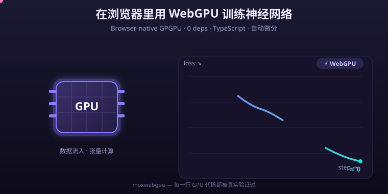

<p align="center">
  
</p>

<h1 align="center">moxwebgpu</h1>

<p align="center">
  
  
  
  
  
  
  
  
  
  
  
</p>

<p align="center">
  <b>English</b> · <a href="README.md">中文</a> · <a href="https://codecloud-dev.github.io/moxwebgpu/docs/">📖 Docs</a> · <a href="https://codecloud-dev.github.io/moxwebgpu/demo/">🚀 Live demo</a>
</p>

<p align="center">
  <b>⭐ If moxwebgpu is useful to you, please give it a <a href="https://github.com/codecloud-dev/moxwebgpu">star</a> — it helps more people run GPU compute in the browser!</b>
</p>

<p align="center">
  
</p>


---

<details>
<summary>📑 目录 · Contents</summary>

- [💡 What it is](#what-it-is)
- [💡 About this project](#about-this-project)
- [📦 Install](#install)
- [🚀 Quick start](#quick-start)
- [📚 Unified API](#unified-api)
- [🐛 Error handling](#error-handling)
- [⚡ Benchmarks](#benchmarks)
- [🧪 Testing & quality](#testing-quality)
- [🌐 Browser demo](#browser-demo)
- [📦 Project structure](#project-structure)
- [🗺️ Roadmap](#roadmap)
- [🤝 Contributing](#contributing)
- [💖 Supporting](#supporting)
- [📜 License](#license)

</details>

## 💡 What it is

Raw WebGPU compute is powerful but brutal: adapter/device boilerplate, WGSL pipelines, bind groups, manual buffer lifecycles, staging readbacks — and **validation errors are silent** (a broken shader just turns your dispatch into a no-op and your output into zeros).

**moxwebgpu** = **MoX** + **WebGPU**: a WebGPU general-purpose compute (GPGPU) framework. It wraps all of the boilerplate behind three layers:

```text
Tensor   gpu.tensor([1,2,3]).add(1).relu().sum().item()   ← the only layer you touch
Lazy graph   topo-sorted, one submit, refcount-recycled buffers
Core     BufferPool (power-of-two buckets) · PipelineCache (WGSL hash) · raw Kernel
```

- **One unified API** — reductions, broadcasting and elementwise ops share one calling convention
- **Lazy by default** — a whole chain dispatches once on `.item()`; intermediates never leak
- **30+ GPU ops** — elementwise, two-phase tree reductions, argmax/argmin, 16×16-tiled matmul, fused softmax, strided slicing/concat, zero-copy reshape
- **Silent-failure defense** — shader compile errors surfaced with line/column via `getCompilationInfo()`
- **48 passing tests** — 27 GPU e2e (value-compared against CPU references) + 21 unit tests, green even on GPU-less machines via SwiftShader + xvfb
- **Zero runtime dependencies**, ESM + CJS + IIFE + d.ts, ~30 KB browser bundle

## 💡 About this project

moxwebgpu is a standalone open-source library: rebuilding, properly, the WebGPU general-purpose compute capability that "should be simple" in the browser.

| Project | Status | One-liner |
| :-----: | :----: | --------- |
| **moxwebgpu** | live (this repo) | WebGPU GPGPU framework |

---

## 📦 Install

> 🟡 **npm / CDN: publish pending (config ready)** — `moxwebgpu` is not on npm yet, so `npm install` / `unpkg` 404 online for now. The OIDC token-less publish flow is wired up (`.github/workflows/publish.yml`); once the npm account is linked it goes live with one `npm publish`. Meanwhile use **From source** below, or the [live demo](#browser-demo).

**Browser `<script>` (zero build):**

```html
<script src="https://unpkg.com/moxwebgpu/dist/moxwebgpu.browser.js"></script>
<script>
  const gpu = await MoxWebGPU.mox.init();
  console.log(await gpu.tensor([1, 2, 3]).sum().item()); // 6
</script>
```

**npm (Node / bundlers):**

```bash
npm install moxwebgpu        # pnpm add moxwebgpu / yarn add moxwebgpu
```

```ts
import { mox } from 'moxwebgpu';           // ESM
// const { mox } = require('moxwebgpu');   // CJS
```

**From source:**

```bash
git clone https://github.com/codecloud-dev/moxwebgpu.git
cd moxwebgpu && pnpm install && pnpm build
```

> WebGPU requires a **secure context**: `localhost` or https. Chrome/Edge 113+ ship it by default.

---

## 🚀 Quick start

```ts
const gpu = await mox.init();
```

### 🔹 Chained & lazy

```ts
const r = await gpu.tensor([1, 2, 3, 4])
  .add(1).relu().mul(10).sum().item();   // 140 — dispatches once
```

### 🔹 Broadcasting (explicit, never silent)

```ts
const A = gpu.tensor([[1, 2, 3], [10, 20, 30]]);  // [2,3]
await A.add(gpu.tensor([1, 2, 3])).toArray();   // row broadcast
await A.mul(gpu.tensor([2, 3])).toArray();      // col broadcast
await A.add(gpu.tensor([1, 2]));                // ❌ throws — no implicit broadcasting
```

### 🔹 Matmul, reductions, softmax

```ts
await gpu.tensor([[1, 2], [3, 4]]).matmul(gpu.tensor([[5, 6], [7, 8]])).toArray();
// [19, 22, 43, 50] — 16×16 workgroup tiling

const x = gpu.tensor([[1, 2, 3, 4], [5, 6, 7, 8]]);
await x.sum().item();      // 36         global → [1]
await x.sum(-1).toArray(); // [10, 26]   last axis
await x.sum(0).toArray();  // [6, 8, 10, 12]   axis 0 → [4]
const t3 = gpu.tensor(Array.from({ length: 24 }, (_, i) => i), { shape: [2, 3, 4] });
await t3.sum(1).toArray(); // [12,15,18,21,48,51,54,57] — any axis of any rank; negative axes count from the end
await x.max().item();      // 8
await x.argmax().item();   // 7 (first occurrence wins)
await x.softmax().toArray(); // numerically stable, row sums = 1
```

### 🔢 Shapes & dtypes

```ts
await v.slice(2, 4).toArray();              // strided slice (≤4D)
await a.concat(b, 0).toArray();             // concat on any axis
const w = v.reshape([2, 5]);                // zero-copy view
await gpu.tensor([1.7, -3.9]).cast('i32').toArray(); // [1, -3] (trunc toward zero)
```

### 📚 One API for max/min

```ts
t.max()        // global reduce → [1]
t.max(-1)      // reduce along last axis (any axis works: t.max(0), t.sum(-2), …)
t.max(other)   // elementwise with another tensor
// unambiguous aliases: maxReduce / minReduce
```

### ⚙️ Raw kernel escape hatch

```ts
const k = gpu.kernel(`
  @group(0) @binding(0) var<storage, read> a: array<f32>;
  @group(0) @binding(1) var<storage, read_write> b: array<f32>;
  @compute @workgroup_size(64)
  fn main(@builtin(global_invocation_id) gid: vec3u) {
    b[gid.x] = a[gid.x] * 2.0 + 1.0;
  }`);
const a = gpu.tensor([1, 2, 3, 4, 5]);
const out = gpu.pool.acquire(5, 'f32');                 // GpuDataBuffer, elements = 5
// Pass the GpuDataBuffer (not .buffer): readback length follows buf.elements → exactly 5
const res = await k.run([a.data, out], { elements: 5 }); // → Float32Array(5) [3, 5, 7, 9, 11]
```

`k.run()` = dispatch + readback in one call; `k.dispatch()` dispatches only. Custom WGSL goes through the same pipeline cache and compile checks.

> Readback length: `run()` prefers the `GpuDataBuffer.elements` count of pooled output buffers (the raw GPUBuffer is rounded up to a power-of-two bucket, so reading its full size would include padding). A bare `GPUBuffer` falls back to its raw size.

---

## 📚 Unified API

### `mox.init(options?)` → `Promise<MoxContext>`

| Option | Type | Notes |
| ------ | ---- | ----- |
| `adapter` | `GPUAdapter` | skip `requestAdapter` |
| `powerPreference` | `'low-power' \| 'high-performance'` | |
| `requestAdapterOptions` | `GPURequestAdapterOptions` | passthrough |

### 🔹 MoxContext

| Member | Notes |
| ------ | ----- |
| `tensor(data, opts?)` | nested arrays / TypedArray; `opts.shape` optional |
| `kernel(code, opts?)` | `workgroupSize` / `entryPoint` / `output` / `dtype` |
| `readback(buf)` | GPU buffer → CPU TypedArray |
| `info()` | `{ vendor, architecture, device, description }` |
| `pool` / `pipelines` / `scheduler` | advanced |
| `destroy()` | release everything |

### 🔹 Tensor

| Category | Members |
| -------- | ------- |
| Props | `shape` `ndim` `dtype` `size` |
| Shape | `reshape(...dims \| number[])` **zero-copy** (`-1` ok), `transpose()` (2D) |
| Binary | `add` `sub` `mul` `div` `pow` (Tensor or scalar), `rsub` `rdiv` |
| Unary | `neg` `abs` `exp` `log` `sqrt` `sin` `cos` `tanh` `floor` `ceil` `relu` `sigmoid` `square` `sign` |
| Reduce | `sum` `mean` `max` `min` (no arg = global; `-1`/`0` = axis; `max(t)` = elementwise), `argmax` `argmin` (→ u32) |
| Range | `clamp(lo, hi)`, `slice(start, size)` (≤4D), `concat(other, axis?)` |
| NN | `softmax()` |
| Dtype | `cast('f32' \| 'i32' \| 'u32')`, `toFloat()` |
| Readback | `await toArray()` / `await toBuffer()` / `await item()` |
| Release | `destroy()` |

### ⚙️ Kernel / BufferPool

| API | Notes |
| --- | ----- |
| `k.run(buffers, { elements } \| { workgroups })` | dispatch + readback |
| `k.dispatch(buffers, [wx, wy, wz])` | dispatch only |
| `pool.acquire(elements, dtype)` / `acquireUniform(bytes)` | strictly separate pools |
| `pool.release` / `releaseUniform` / `live` / `pooled` / `clear()` | stats & teardown |

### 🧮 Op reference

| Family | Ops | GPU strategy |
| ------ | --- | ------------ |
| Elementwise | add sub mul div pow min max clamp + rsub rdiv | 1D / 2D row/col broadcast uniforms |
| Unary (14) | neg abs exp log sqrt sin cos tanh floor ceil relu sigmoid square sign | single pass |
| Global reduce | sum mean max min argmax argmin | two-phase tree (wg=64, chunk=8) |
| Axis reduce | `sum(-1)`, 2D `sum(0)` (via transpose) | one workgroup per row |
| Matrix | matmul | 16×16 tile, workgroup-memory accumulation |
| Shape | transpose (2D), slice (≤4D), concat, reshape (zero-copy) | generic ND gather/copy (vec4 uniforms) |
| NN | softmax | fused 3-pass per row |
| Dtype | cast f32↔i32↔u32 | single pass, truncation |

### 🔢 dtypes & uniform layout

| dtype | WGSL | bytes | readback |
| ----- | ---- | ----- | -------- |
| `f32` | `f32` | 4 | `Float32Array` |
| `i32` | `i32` | 4 | `Int32Array` |
| `u32` | `u32` | 4 | `Uint32Array` |

All uniform blocks are 16-byte aligned; copy-family kernels use a 64-byte vec4-based block. Two hard-won lessons are baked into the design — see [docs/ARCHITECTURE.md](docs/ARCHITECTURE.md) §8:

1. **±Infinity is illegal in WGSL const-expressions** → reduction identities ride in a uniform slot at runtime.
2. **Array strides in the uniform address space are inconsistently implemented across backends; vec4 member layout is not** → copy kernels use vec4 dimensions (208 B → 64 B, too).

---

## 🐛 Error handling

WebGPU validation errors **don't throw** — objects go invalid, dispatches become no-ops. moxwebgpu's `PipelineCache` calls `getCompilationInfo()` after creating every `ShaderModule` and turns compile errors into readable line/column messages.

| Error (excerpt) | Meaning |
| --------------- | ------- |
| `moxwebgpu: WebGPU is not available here...` | no secure context / unsupported browser |
| `moxwebgpu: no suitable GPU adapter` | adapter blocked; update drivers |
| `moxwebgpu: broadcast failed ...` | shapes neither equal nor broadcastable |
| `moxwebgpu: slice range [...] out of bounds` | slice OOB |
| `moxwebgpu: axis ... reduce is not supported` | this op has no axis-reduce form (e.g. `argmax`); omit the argument for a global reduce |
| `moxwebgpu: mean requires f32 input` | `mean` is f32-only; cast integers first (`cast('f32')`) |

---

## ⚡ Benchmarks

`pnpm bench`, medians on SwiftShader (pure-CPU GPU emulation, same env as CI), full dispatch + readback path:

| Workload | Time | Throughput |
| -------- | ---- | ---------- |
| add 1M f32 (scalar) | tens of ms | — |
| matmul [512×512]·[512×512] | ~890 ms | ~0.3 GFLOP/s |
| sum 1M f32 (two-phase tree) | ~69 ms | — |
| add→relu→mul→sum 1M chain | ~285 ms | — |

SwiftShader emulates a GPU on CPU — treat these as cross-regression numbers only. On real hardware the same code typically runs **10–100× faster**.

Built-in performance design: lazy graph (one readback per chain), refcounted intermediates + power-of-two buckets (near-zero steady-state allocation), WGSL-hash pipeline cache.

---

## 🧪 Testing & quality

| Suite | Count | Coverage |
| ----- | ----- | -------- |
| `tests/unit/` | 21 | byte-level uniform encoders, WGSL codegen, topo sort, OpDef shapes |
| `tests/gpu/` | **27** | elementwise / broadcast / unary chains / lazy chains / matmul ×3 / all reductions / argmax / softmax / slice / concat / reshape views / deep pipelines / raw Kernel |
| `tests/gpu/bench/` | bench | elementwise / matmul / reduce / chain (medians) |

GPU cases are value-compared against **CPU reference implementations** — not "didn't crash" tests.

### 🔹 Real WebGPU on GPU-less machines (SwiftShader recipe)

```bash
# xvfb supplies a virtual display; Chrome's SwiftShader Vulkan ICD is the GPU

export VK_ICD_FILENAMES=/opt/google/chrome/vk_swiftshader_icd.json

# full Chromium (headless-shell has WebGPU stripped) + key flags
chromium --enable-unsafe-webgpu --enable-features=Vulkan --no-sandbox

# must load an https (or localhost) page for a secure context
```

`tests/gpu/harness.ts` automates all of it: detect Chrome + ICD → launch → open https page → inject `dist/moxwebgpu.browser.js` → run each case in-page and compare against CPU references. **GitHub Actions runs the same recipe** (`.github/workflows/ci.yml`).

| Command | What it does |
| ------- | ------------ |
| `pnpm build` | tsup → ESM / CJS / IIFE + d.ts |
| `pnpm test` | 21 unit tests |
| `pnpm test:gpu` | 27 GPU e2e (auto SwiftShader/xvfb) |
| `pnpm test:all` | both |
| `pnpm bench` | micro-benchmarks |
| `pnpm demo` | build + serve the demo page (:5173) |
| `pnpm exec tsc --noEmit` | type check |

---

## 🌐 Browser demo

🌐 **Try it live (no install):**[https://codecloud-dev.github.io/moxwebgpu/demo/](https://codecloud-dev.github.io/moxwebgpu/demo/) — your GPU, computing in front of you.

[`examples/browser/index.html`](examples/browser/index.html) is a self-contained liquid-glass demo — aurora ambient light, cursor-following glow, glass cards with backdrop filters. Four cards, all genuinely running on WebGPU: chained ops, 128² matmul, softmax with row-sum check, 1M-element reductions.

```bash
pnpm demo   # → http://localhost:5173
```

## 📦 Project structure

```text
moxwebgpu/
├── src/
│   ├── index.ts                 # exports + installTensorOps + version
│   ├── core/                    # context · dtype · buffer(pool) · kernel
│   ├── graph/                   # lazy(DAG/OpDef) · pipelineCache · scheduler
│   └── tensor/                  # tensor.ts · codegen.ts · ops/{elementwise,reduce,matmul,shape,nn}
├── tests/
│   ├── unit/core.test.ts        # 21 unit tests
│   └── gpu/                     # harness · ref(CPU) · 3 suites + bench/
├── scripts/run-gpu-tests.sh     # VK_ICD + xvfb wrapper
├── examples/browser/index.html  # liquid-glass demo
├── docs/ARCHITECTURE.md         # deep dive: uniforms, scheduler, post-mortems
├── assets/logo.svg              # liquid-glass logo
└── .github/workflows/ci.yml     # CI: typecheck + build + unit + SwiftShader e2e
```

Want to add an op? `OpDef` = pure metadata (shape inference + codegen) → two to five steps, see [docs/ARCHITECTURE.md](docs/ARCHITECTURE.md) §5.

## 🗺️ Roadmap

- [ ] f16 / bf16 dtypes
- [x] arbitrary-axis reductions (any rank, negative axes)
- [ ] tensor-core-friendly matmul (double buffering)
- [ ] multi-pass fusion in the scheduler
- [ ] Ecosystem integrations

## 🤝 Contributing

Issues and PRs welcome. Keep PRs focused; add tests for behavior changes. GPU-affecting changes should run `pnpm test:gpu` locally (SwiftShader works on any machine).

## 💖 Supporting

moxwebgpu is an independently developed, free and open-source project, and will keep being maintained. **If it saves you time writing WebGPU boilerplate, a ⭐ star goes a long way** — it is what helps others find the project.

If it is useful in your work, you can also support development:

- Afdian: https://afdian.com/a/cloudharbor

Stars, shares, or telling me where you use it are the best support. See [FUNDING.yml](FUNDING.yml) for the channels.

## 📜 License

[MIT](LICENSE) © Codecloud. Designed by **Codecloud**; code co-written with AI, human-reviewed.
